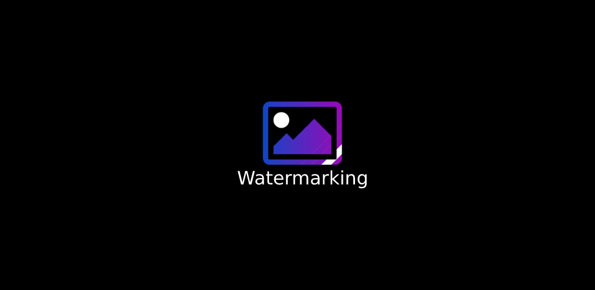
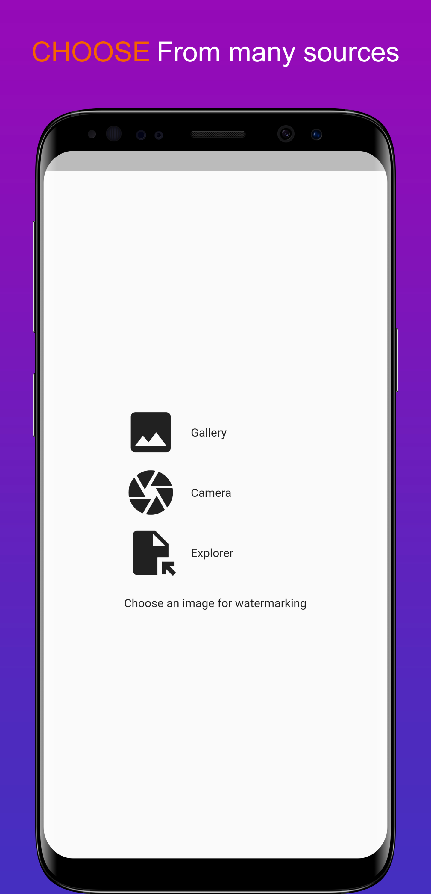
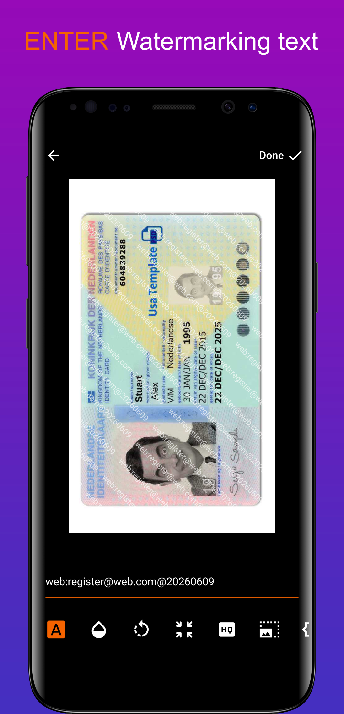
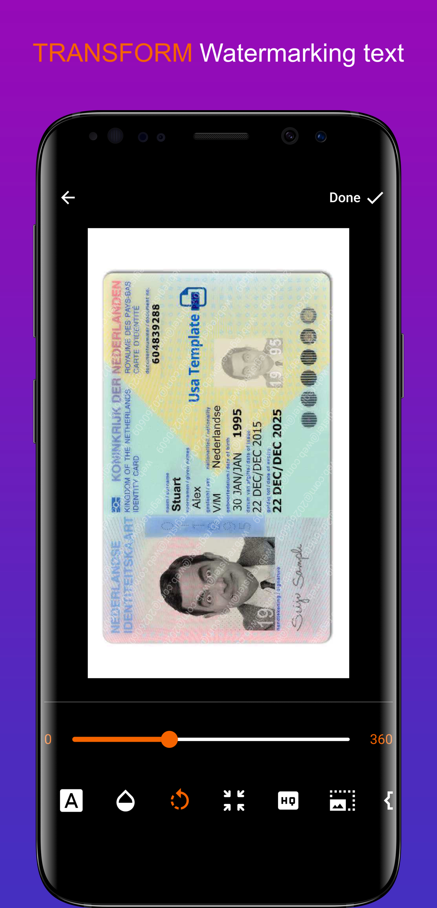
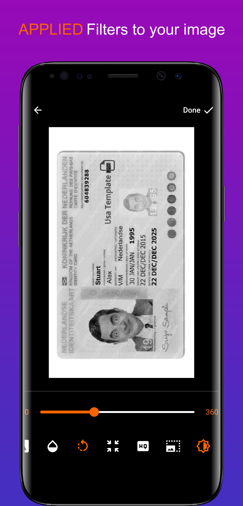

# Watermarking

Free and easy watermarking tool for your sensitive images

Available to download from
- [ ] F-Droid
- [x] Google Play Store
- [ ] App Store

---

### Your sensitive images should be watermarked before sending to someone to protect against exploitation by unkind or immoral people.

### Security
- code is fully open source to be audited by the public and free to fork and modify
- no stats, no share crash info, no nonsense
- there are no networking involve so no images being sent or collect from the app to the internet

### Uses
Use it however you want, eg: watermark your passport or id before sending it to someone.

Example, watermark "web:register@some-web.com@20260609" onto your passport before sending it for register at some website which requires your passport info.

Note that this will reduce info being leaked and possibly knows where it might leaked from the "web" channel which you watermarked but cannot fully prevent someone from re-upload or leaked it, but at least u know it is from "web" channel and maybe on what action("register@some-web.com") you did from your phone or computer etc.

---

MIT License (MIT)

Copyright © 2023 xshadowlegendx
